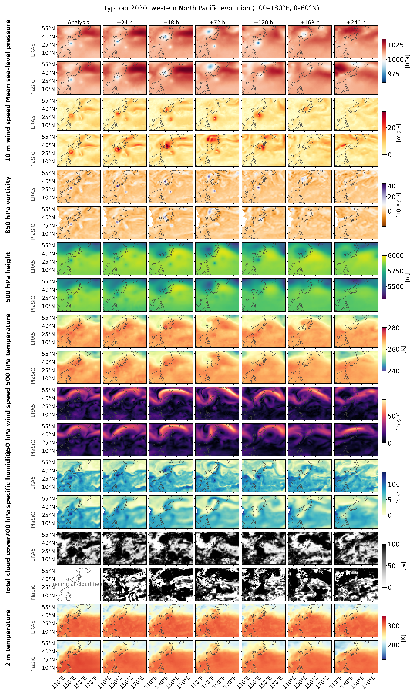

<div align="center">
  

  <h1>PlaSiC</h1>

  <p><b>Planet Simulator in C</b> &nbsp;·&nbsp; <i>a general circulation model made to be understood.</i></p>

  <p>A fully coupled GCM in ~20,000 lines of C11,<br>
  with a 400+ page textbook, CMIP-style experiments and a modern desktop interface.</p>
</div>

<p align="center">
  <a href="https://sunmoumou1.github.io/PlaSiC/"></a>
  <a href="https://sunmoumou1.github.io/PlaSiC/tutorial/"></a>
  <a href="https://drive.usercontent.google.com/download?id=1PaMNy_Bc8rSRLUIjQizExJ17wFgWT9Ag&amp;export=download&amp;confirm=t"></a>
  <a href="https://www.bilibili.com/video/BV1Q4h26FELk/"></a>
</p>

<p align="center">
  
  
  
  
  <a href="LICENSE"></a>
  <a href="https://github.com/sunmoumou1/PlaSiC/actions/workflows/docs.yml"></a>
</p>

---

| Where to go | |
|---|---|
| **Read the book** | [Online tutorial](https://sunmoumou1.github.io/PlaSiC/tutorial/) · [PDF, 63 MB](https://drive.usercontent.google.com/download?id=1PaMNy_Bc8rSRLUIjQizExJ17wFgWT9Ag&export=download&confirm=t) · [Preface](https://sunmoumou1.github.io/PlaSiC/tutorial/preface/) |
| **Run the model** | [Quick start](#quick-start) · [PlaSiC Studio](#plasic-studio) · [Experiments](#experiments-out-of-the-box) · [Build dependencies](#build-dependencies) |
| **Watch the video** | **▶ [PlaSiC Studio interface walkthrough on Bilibili](https://www.bilibili.com/video/BV1Q4h26FELk/)** |
| **Understand the design** | [Project website](https://sunmoumou1.github.io/PlaSiC/) · [Source tour](https://sunmoumou1.github.io/PlaSiC/source.html) · [Benchmarks](#benchmarks) |
| **Join in** | [Roadmap](#roadmap) · [Contributing](#contributing) · [Citing PlaSiC](#citing-plasic) · [About the author](#about-the-author) |

## What is PlaSiC?

**PlaSiC** (*Planet Simulator in C*) is a general circulation model of intermediate
complexity: a fully coupled atmosphere–land–ocean–sea-ice climate system that is
detailed enough to reproduce the essential behavior of the climate, yet compact
enough for one reader to study from the first line to the last. 

The project exists for two audiences:

<p align="center">
  
</p>

| | At a glance |
|---|---|
| **Language** | C11 — about 20,000 lines of C in `src/`, no Fortran |
| **Dynamical core** | Primitive equations in σ coordinates; spectral transform via [SHTns](https://nschaeff.bitbucket.io/shtns/); leapfrog time stepping with a semi-implicit gravity-wave solver and Robert–Asselin filtering |
| **Resolution** | T21 / T31 / T42 / T85 (64 × 32 → 256 × 128 Gaussian grids), user-defined σ levels |
| **Physics** | Radiation, clouds, moist convection and precipitation, surface fluxes, horizontal and vertical diffusion |
| **Coupled surfaces** | Land surface, thermodynamic sea ice, slab ocean, user-defined three-dimensional ocean |
| **Parallelism** | MPI; 4 processes are the practical optimum on m5 macbook (32G memory) (up to ~3× faster than 1) |
| **Interfaces** | `plasic.x` command-line model · PlaSiC Studio (PySide6) desktop front end |
| **Experiments** | CMIP6-style `historical`, `1pctCO2`, `abrupt-4xCO2` — all reproducible from this repository |
| **Documentation** | 400+ page tutorial: [read online](https://sunmoumou1.github.io/PlaSiC/tutorial/) or [download the PDF](https://drive.usercontent.google.com/download?id=1PaMNy_Bc8rSRLUIjQizExJ17wFgWT9Ag&export=download&confirm=t) |
| **License** | `GPL-3.0-or-later` |

## Highlights

**A complete climate system**

- A spectral-transform atmosphere solving the primitive equations on σ levels,
  with vorticity, divergence, temperature, surface pressure and specific humidity
  as prognostic variables.
- Full physical parameterizations: radiation with ozone, cloud and water-vapor
  effects; moist convection and large-scale precipitation; surface fluxes over
  land and sea; horizontal and vertical diffusion.
- Coupled spheres: a land-surface model with soil temperature, moisture and snow;
  thermodynamic sea ice; a 50 m mixed-layer ocean; and a user-defined three-dimensional
  ocean whose top layer aligns with that mixed layer.
- CMIP6-style experiments out of the box — a historical 1850–2014 simulation and
  the idealized `1pctCO2` and `abrupt-4xCO2` projections. See [Experiments](#experiments-out-of-the-box).

<p align="center">
  
</p>

**Built for reading**

- Roughly 20,000 lines of C11, organized by physical process — one module per
  process, from `dynamical_core/` to `sea/3docean.c`, so the code can be read in
  the same order as the tutorial.
- Every governing equation is derived in the [online tutorial](https://sunmoumou1.github.io/PlaSiC/tutorial/)
  and then tied to the file and function that implements it.
- A **source tour** that walks the complete tree file by file:
  [sunmoumou1.github.io/PlaSiC/source.html](https://sunmoumou1.github.io/PlaSiC/source.html).

**Built for running and showing**

- MPI parallel builds with restart files shipped for every resolution, so a first
  run needs no data preparation.
- Monthly-mean NetCDF output, JSON progress records, and a documented restart file
  format for analysis pipelines.
- **PlaSiC Studio**, a graphical front end that builds, launches, monitors and
  visualizes the model — 2-D fields on a rotatable globe, or 3-D volumes over a
  selected region. ▶ **Watch the full interface walkthrough on
  [Bilibili](https://www.bilibili.com/video/BV1Q4h26FELk/)**.

## PlaSiC Studio

PlaSiC Studio configures a build and a run on the left, then streams the model
output live on the right: build and run parameters, resolution and MPI settings,
and one-click quick starts from a single day to a year.

<p align="center">
  
</p>

<p align="center"><sub><b>2-D visualization.</b> Wind speed at σ level 0, rendered on an interactive globe while the model is running.</sub></p>

<p align="center">
  
</p>

<p align="center"><sub><b>3-D visualization.</b> The same run as a volume rendering over a selected region and vertical extent.</sub></p>

```bash
cd plasic_app
python3 -m venv .venv && source .venv/bin/activate
pip install -e .
plasic-app                # or: python -m plasic_app
```

The app finds the C model in `../src`; set `PLASIC_C_ROOT` if the model lives
elsewhere. A guided tour of the interface — with the full walkthrough video — is on
the [software page](https://sunmoumou1.github.io/PlaSiC/software.html), and
[Chapter 8](https://sunmoumou1.github.io/PlaSiC/tutorial/8-desktop-app/8.1-plasic-app-architecture-guide/)
of the tutorial describes how the app is put together.

<p align="center">
  <a href="https://www.bilibili.com/video/BV1Q4h26FELk/"></a>
</p>

## Quick start

| Dependency | Purpose |
|---|---|
| C compiler (`cc`, `clang`, `gcc`) | builds the C11 sources |
| [SHTns](https://nschaeff.bitbucket.io/shtns/) (with FFTW3) | spherical-harmonic transforms |
| NetCDF-C | reads surface boundary data, writes monthly output |
| LAPACK | matrix inversion (the Accelerate framework on macOS) |
| Open MPI (`mpicc`, `mpirun`) | MPI builds and runs |
| `pkg-config` | locates libraries and link flags |

A complete step-by-step installation for macOS — including building SHTns 3.7.5 —
is in [Build dependencies](#build-dependencies) below.

```bash
# Build the default configuration (T31, 13 levels, 2 MPI processes)
make -C src

# Integrate 100 time steps; results are written to run/
make -C src run

# Same, with a larger grid: T42, 16 levels, 4 MPI processes
make -C src NLAT=64 NLEV=16 NPRO=4

# Treat every warning as an error (cleans build/ and run/ first)
make -C src strict
```

`make run` writes a restart file (`status`) and a JSON progress log
(`progress.txt`) into `run/T31_L13_MPI_P2_O16/`. Because the restart file is reused
automatically, the next `make run` continues from where the previous one stopped.
Add `MPI=0` for a serial build, or see the
[user guide](https://sunmoumou1.github.io/PlaSiC/tutorial/1-user-guide/1.1-Running-PlaSiC-first/)
for every available switch.

## Experiments out of the box

Every experiment below is reproducible with the scripts in this repository, and
each is documented, figure by figure, in the tutorial. The three groups are a
historical simulation, the idealized CO₂ projections, and ERA5-initialized
weather forecasts.

### 1. Historical (1850–2014)

Prescribed monthly CO₂ from the CMIP6 dataset (284.3 → 397.6 ppmv) drives a T21,
10-level coupled run, after a 500-year ocean spin-up. The ensemble-mean
near-surface warming reaches **+1.04 K by 2014**, close to the observational
estimate, with stratospheric cooling and tropospheric warming aloft. The full
pipeline takes roughly 7–8 hours on a modern laptop.

```bash
make -C src historical INITIAL_CONDITION=data/earth_t21_l10.restart
```

→ [Chapter 6.2, Historical experiment](https://sunmoumou1.github.io/PlaSiC/tutorial/6-experiments/6.2-historical-experiment-1850-2014/)

<p align="center">
  
</p>

<p align="center"><sub><b>Forced surface warming relative to control.</b> Annual global near-surface air-temperature anomalies for two branches, their smoothed ensemble mean, and the observed estimate.</sub></p>

### 2. Idealized CO₂ (`1pctCO2` and `abrupt-4xCO2`)

Run with a coupled ocean from the same equilibrated initial state. In
`1pctCO2`, spatially uniform CO₂ rises by 1% yr⁻¹, compounded monthly, for 140
years and reaches approximately 4× its initial concentration; the model warms
by **+5.37 K in year 140**. The transient climate
response is **TCR = 3.29 K**, defined as the 20-year mean temperature anomaly
over protocol years 61–80 (calendar years 1910–1929). In `abrupt-4xCO2`, CO₂ is
stepped immediately to about 1,137 ppm (4×) and held for 150 years; the model
warms by **+5.91 K in year 150**. A Gregory regression over the 149 annual means
from 1851–1999 gives an effective 4× forcing of **9.27 W m⁻²**, a feedback
parameter of **λ = −0.829 W m⁻² K⁻¹**, and an effective equilibrium climate
sensitivity of **ECS = 5.59 K** (R² = 0.884). PlaSiC's TCR is above the CMIP6
sample range of 1.305–3.058 K (31 models), while its effective ECS is just below
the 1.831–5.616 K range (30 models).

→ [Chapter 6.3, Idealized CO₂ experiments](https://sunmoumou1.github.io/PlaSiC/tutorial/6-experiments/6.3-idealized-co2-experiments-tcr-ecs/)

<p align="center">
  
</p>

<p align="center"><sub><b>Climate sensitivity compared with CMIP6.</b> Transient climate response (TCR, left) and effective ECS (right): grey points and violins are CMIP6 models, red diamonds are PlaSiC's single-member values. CMIP6 diagnostics from <a href="https://github.com/mark-ringer/cmip6">mark-ringer/cmip6</a> (CC BY-SA 4.0).</sub></p>

### 3. Weather forecast (ERA5-initialized 10-day forecasts)

PlaSiC is initialized from ERA5 reanalysis and integrated freely for 10 days at
T85/L25 (128 × 256 Gaussian grid, 25 σ levels, 15-minute dynamics, 96 steps per
day), then verified against ERA5 at matching valid times with the WeatherBench 2
headline variables and metrics. Three 2020 cases are archived: a winter
mid-latitude flow, a summer circulation and Typhoon Maysak. Each case is run
from two initial states — a **direct** analysis, written to the two leapfrog levels
at the start time, and a **nudged** analysis, in which a 12-hour window is
integrated in one-hour cycles that relax the model toward the mapped ERA5
analysis, so the free forecast begins from a state the model has adjusted to.

Overall, the nudged initialization keeps useful large-scale skill for about
five days against a climatology baseline. One case is shown below:

→ [Chapter 6.6, ERA5-initialized 10-day forecasts](https://sunmoumou1.github.io/PlaSiC/tutorial/6-experiments/6.6-era5-initialized-10day-forecasts/)

<p align="center">
  
</p>

<p align="center"><sub><b>Typhoon Maysak in a 10-day forecast.</b> Western North Pacific zoom (100–180 °E, 0–60 °N) of the typhoon2020 case; each diagnostic occupies two rows — ERA5 above, the nudged PlaSiC forecast below — at lead times from the analysis to +240 h.</sub></p>

## Benchmarks

Measured on one Apple M5 laptop (10 cores, 32 GiB), Apple clang 17, Open MPI 5.0.9,
with the full three-dimensional ocean and full physics:

| Truncation | Grid | Levels | Steps per day | Simulated years per day | 100 simulated years |
|---|---|---|---|---|---|
| T21 | 64 × 32 | 10 | 32 | **2,650** | ≈ 0.9 hours |
| T31 | 96 × 48 | 13 | 40 | 620 | ≈ 3.9 hours |
| T42 | 128 × 64 | 16 | 48 | 196 | ≈ 12 hours |
| T85 | 256 × 128 | 25 | 96 | 9.5 | ≈ 10.5 days |

Values use the best configuration (4 MPI processes) in each case. Memory is modest:
a T42 process needs about 100 MiB when running alone, or 38 MiB per rank at 4
processes. The full study — speed-up, parallel efficiency and a memory model — is in
[Chapter 6.1](https://sunmoumou1.github.io/PlaSiC/tutorial/6-experiments/6.1-speed-and-memory-benchmark/).

<p align="center">
  
</p>

## Documentation and tutorial

<table>
<tr>
<td width="530"></td>
<td>
The PlaSiC tutorial is a complete, self-contained textbook: 400+ pages across
eight chapters and six appendices.<br><br>
<a href="https://sunmoumou1.github.io/PlaSiC/tutorial/">Read online</a> &nbsp;·&nbsp;
<a href="https://drive.usercontent.google.com/download?id=1PaMNy_Bc8rSRLUIjQizExJ17wFgWT9Ag&export=download&confirm=t">Download PDF (63 MB)</a> &nbsp;·&nbsp;
<a href="https://sunmoumou1.github.io/PlaSiC/tutorial.html">Book landing page</a>
</td>
</tr>
</table>

| Chapter | What it covers |
|---|---|
| [Preface](https://sunmoumou1.github.io/PlaSiC/tutorial/preface/) | Why PlaSiC was built, and for whom |
| [1 User guide](https://sunmoumou1.github.io/PlaSiC/tutorial/1-user-guide/1.1-Running-PlaSiC-first/) | Build, run, restart, and the global state variables |
| [2 Dynamical core](https://sunmoumou1.github.io/PlaSiC/tutorial/2-dynamical-core/2.1-governing-equations/) | Governing equations, the ten-step algorithm, spectral transforms, σ levels, the semi-implicit solver, leapfrog and filtering |
| [3 Parameterizations](https://sunmoumou1.github.io/PlaSiC/tutorial/3-parameterizations/3.1-why-parameterization/) | Surface fluxes, diffusion, radiation, moist convection and precipitation |
| [4 Model and coupling](https://sunmoumou1.github.io/PlaSiC/tutorial/4-model-and-coupling/4.1-how-the-spheres-are-coupled/) | How the spheres are coupled: land, sea interface, sea ice, slab ocean, 3-D ocean |
| [5 Time control](https://sunmoumou1.github.io/PlaSiC/tutorial/5-time-control/5.1-calendar/) | Calendar and solar orbital geometry |
| [6 Experiments](https://sunmoumou1.github.io/PlaSiC/tutorial/6-experiments/6.1-speed-and-memory-benchmark/) | Benchmarks, historical and CO₂ experiments, restart format, cold-start fields |
| [7 Parallel](https://sunmoumou1.github.io/PlaSiC/tutorial/7-parallel/7.1-mpi-parallel-basics/) | MPI parallel basics |
| [8 Desktop app](https://sunmoumou1.github.io/PlaSiC/tutorial/8-desktop-app/8.1-plasic-app-architecture-guide/) | App architecture, and building an interactive 3-D globe |
| [9 Appendix](https://sunmoumou1.github.io/PlaSiC/tutorial/9-appendix/9.1-matrix-inversion/) | Matrix inversion, transform mathematics, a PySide6 primer, a C primer, physical constants |

**Build the documentation locally**

```bash
cd docs-site
python3 -m venv .venv
.venv/bin/pip install -r requirements.txt
.venv/bin/mkdocs serve -f mkdocs.yml
```

## Roadmap

> [!IMPORTANT]
> **🚀 PlaSiC is a living project — the code, the
> [tutorial](https://sunmoumou1.github.io/PlaSiC/tutorial/) and the
> [desktop app](https://sunmoumou1.github.io/PlaSiC/software.html) are all under
> rapid development, and I will keep maintaining them for years to come.**
>
> **Come back to this repository often** — new features all land here first.

<p align="center">
  <a href="https://github.com/sunmoumou1/PlaSiC/commits/main"></a>
  <a href="https://github.com/sunmoumou1/PlaSiC/commits/main"></a>
</p>

Planned for future releases (✅ = delivered, ⬜ = planned):

- ⬜ **Aerosol-related physical processes.**
- ⬜ **External ozone forcing** — ozone will be read from external data rather than
  prescribed internally, so historical experiments can be driven by CO₂ and ozone
  together.
- ⬜ **Particle tracking and visualization** — follow air parcels and tracers through
  the simulated circulation, with visualization support.
- ✅ **Weather simulation experiments** — initialize from an observed weather state
  and integrate forward, quantifying forecast-error growth from day 0 to day 10.
  Delivered as the [ERA5-initialized 10-day
  forecasts](https://sunmoumou1.github.io/PlaSiC/tutorial/6-experiments/6.6-era5-initialized-10day-forecasts/).
- ⬜ **More grids** — beyond the conventional Gaussian grid, I plan to support the
  Octahedral Gaussian grid (Malardel, Sylvie, et al. "A new grid for the IFS."
  ECMWF newsletter 146.23-28 (2016): 321.) and the HEALPix grid (Gorski, Krzysztof
  M., et al. "HEALPix: A framework for high-resolution discretization and fast
  analysis of data distributed on the sphere." The Astrophysical Journal 622.2
  (2005): 759-771.).

Ideas, feature requests and contributions are welcome — see below.

## Contributing

PlaSiC is an open project and contributions of every size are useful:

- **Report a problem** — if you find a documentation error, a broken link or a
  rendering problem, please open a
  [GitHub issue](https://github.com/sunmoumou1/PlaSiC/issues). For problems that
  concern running the model, attach `progress.txt`, your build configuration and
  the relevant part of the log so the issue can be diagnosed.
- **Contribute code** — new parameterizations, diagnostics, analysis scripts and
  performance work are all in scope; the [roadmap](#roadmap) lists the largest
  opportunities.
- **Spread the word** — if PlaSiC helps your teaching or research, a star on the
  repository helps other students find it.

## Citing PlaSiC

We plan to submit a paper describing PlaSiC. Once it is accepted, we will add a
link to the paper here. In the meantime, please cite the project as follows:

```bibtex
@misc{PlaSiC2026,
  author       = {Sun, Sencan},
  title        = {{PlaSiC}: Planet Simulator in C --- a {GCM} made to be understood},
  year         = {2026},
  howpublished = {\url{https://sunmoumou1.github.io/PlaSiC/}},
  note         = {C11 climate model with tutorial and desktop application}
}
```

## License and attribution

Except for third-party materials stated otherwise, PlaSiC's C code, build and test
scripts, desktop application, online tutorial, and website source are released under
the **GNU General Public License version 3 or later** (SPDX: `GPL-3.0-or-later`).

The GPL permits research, teaching, modification, redistribution, and commercial
use. When distributing binaries or derivative works governed by the GPL,
distributors must provide the complete corresponding source code, retain applicable
notices, and release GPL-covered derivative works under compatible GPL terms. This
software and documentation are provided without any warranty.

Third-party materials and external dependencies remain subject to their own licenses
and are not relicensed by being included in, or used with, this project.

**Relationship to PlaSim.** PlaSiC is a derivative of
[PlaSim (Planet Simulator)](https://github.com/HartmutBorth/PLASIM). Upstream PlaSim
is licensed under `GPL-2.0-or-later`, and the original authors' copyright and license
notices remain in force; a copy of the GPLv2 text is included in
[`LICENSES/`](LICENSES/). Since 2026, PlaSiC has reimplemented the model in C11,
restructured the software, removed the SimBA module, added the historical,
`4xCO2` and `1pctCO2` experiments, and introduced the desktop application and the
online tutorial. The combined PlaSiC work is released under `GPL-3.0-or-later`,
exercising the "GPL v2 or any later version" permission granted by the upstream
project.

**Peer projects.** This project owes a great deal to the teaching materials and
open-source work of others. In particular, *Introduction to Climate Modelling* by
Stocker (2011) shaped how the physics and mathematics are presented, and
[SpeedyWeather.jl](https://github.com/SpeedyWeather/SpeedyWeather.jl) (Klöwer et al.,
2024) is an inspiring model of an interactive, approachable atmospheric GCM.
Without these two resources, PlaSiC could not have been designed.

- Stocker, T. (2011). *Introduction to Climate Modelling*. Springer Science & Business Media.
- Klöwer, M., Gelbrecht, M., Hotta, D., Willmert, J., Silvestri, S., Wagner, G. L., White, A., Hatfield, S., Kimpson, T., Constantinou, N. C., & Hill, C. (2024). SpeedyWeather.jl: Reinventing atmospheric general circulation models towards interactivity and extensibility. *Journal of Open Source Software*, *9*(98), 6323. [https://doi.org/10.21105/joss.06323](https://doi.org/10.21105/joss.06323)

## About the author

<table>
<tr>
<td width="150"></td>
<td>
<b>Sencan Sun (孙森灿)</b><br>
Doctoral student in Atmospheric Science<br>
Department of Earth System Science, Tsinghua University<br><br>
My research sits where machine learning meets atmospheric science: <b>AI for operational
forecasting</b>, spanning data assimilation, weather, subseasonal-to-seasonal and climate
prediction. PlaSiC is the teaching model he built to close the gap between the two
disciplines.<br><br>
<a href="https://sunmoumou1.github.io">🌐 Personal website</a> &nbsp;·&nbsp;
<a href="mailto:ssc23@mails.tsinghua.edu.cn">✉️ ssc23@mails.tsinghua.edu.cn</a> &nbsp;·&nbsp;
<a href="https://sunmoumou1.github.io/PlaSiC/tutorial/author/">About the author</a>
</td>
</tr>
</table>

<p align="center">
  
</p>

> *"Good educational models — models that come with complete source code and a
> complete tutorial, that are small enough to understand yet complete in all their
> essential components — are extremely rare. So I decided to build such a tool
> myself."* — from the [Preface](https://sunmoumou1.github.io/PlaSiC/tutorial/preface/)

## Build dependencies

PlaSiC's horizontal scalar and vector spherical-harmonic transforms are performed by
[SHTns](https://nschaeff.bitbucket.io/shtns/), which internally uses FFTW3. This
project has been tested with SHTns 3.7.5.

Below is the complete procedure for installing SHTns into a persistent user
directory on macOS. The installation prefix is `$HOME/.local/shtns-3.7.5`.

### 1. Install the base dependencies

Install [Homebrew](https://brew.sh/) first, then FFTW3, NetCDF-C and `pkg-config`:

```bash
brew install fftw netcdf pkg-config
```

For MPI builds and runs, also install Open MPI:

```bash
brew install open-mpi
```

### 2. Set the version, prefix and work directory

```bash
SHTNS_VERSION="3.7.5"
SHTNS_PREFIX="$HOME/.local/shtns-${SHTNS_VERSION}"
SHTNS_WORK="$HOME/Downloads/shtns-${SHTNS_VERSION}-build"

mkdir -p "$SHTNS_WORK"
cd "$SHTNS_WORK"
```

`SHTNS_PREFIX` is the final installation directory; `SHTNS_WORK` only holds the
downloaded source and intermediate build files.

### 3. Download SHTns 3.7.5

```bash
curl -fL \
  "https://files.pythonhosted.org/packages/35/60/241291c0a737d269efd0ae02a488172721f1ad4b226729613cf8d12d3a4f/shtns-3.7.5.tar.gz" \
  -o "shtns-3.7.5.tar.gz"
```

### 4. Unpack and configure

```bash
tar -xzf "shtns-3.7.5.tar.gz"
cd "shtns-3.7.5"

FFTW_PREFIX="$(brew --prefix fftw)"

CPPFLAGS="-I${FFTW_PREFIX}/include" \
LDFLAGS="-L${FFTW_PREFIX}/lib" \
./configure \
  --prefix="$SHTNS_PREFIX" \
  --disable-openmp
```

In PlaSiC's teaching-oriented MPI path, every process performs its own complete
SHTns transform. SHTns' internal OpenMP is therefore disabled here, so that MPI
processes and OpenMP threads do not compete for the same CPUs.

### 5. Compile SHTns

```bash
make -j"$(sysctl -n hw.logicalcpu)"
```

A successful build produces the static library:

```bash
ls -lh libshtns.a
```

### 6. Install into the persistent prefix

In a non-GPU build, `make install` from the SHTns 3.7.5 source package may still try
to copy CUDA headers that are not present. PlaSiC only needs `shtns.h` and
`libshtns.a`, so install those two files directly:

```bash
mkdir -p "$SHTNS_PREFIX/include"
mkdir -p "$SHTNS_PREFIX/lib"

install -m 0644 shtns.h \
  "$SHTNS_PREFIX/include/shtns.h"

install -m 0644 libshtns.a \
  "$SHTNS_PREFIX/lib/libshtns.a"
```

Check the result:

```bash
ls -lh \
  "$SHTNS_PREFIX/include/shtns.h" \
  "$SHTNS_PREFIX/lib/libshtns.a"
```

### 7. Let PlaSiC find SHTns permanently

Add to `~/.zshrc`:

```bash
export SHTNS_PREFIX="$HOME/.local/shtns-3.7.5"
```

Then reload the shell configuration:

```bash
source ~/.zshrc
```

Verify the variable:

```bash
echo "$SHTNS_PREFIX"
```

which should print something like:

```text
/Users/your-name/.local/shtns-3.7.5
```

PlaSiC's Makefile reads this variable, so later builds do not need it passed on the
command line. If you prefer not to edit `~/.zshrc`, specify it for each build
instead:

```bash
make -C src SHTNS_PREFIX="$HOME/.local/shtns-3.7.5"
```

### 8. Build and test PlaSiC

From the project root, run a strict-warning build first:

```bash
make -C src strict
```

Build the serial model:

```bash
make -C src MPI=0
```

Build the two-process MPI model:

```bash
make -C src MPI=1 NPRO=2
```

The Makefile locates FFTW3 with `pkg-config` when possible; `SHTNS_CFLAGS`/`SHTNS_LIBS`
and `FFTW_CFLAGS`/`FFTW_LIBS` can also be overridden directly. Because `libshtns.a`
is linked statically, running PlaSiC does not require setting `DYLD_LIBRARY_PATH`.

## Star history

<p align="center">
  <a href="https://star-history.com/#sunmoumou1/PlaSiC&amp;Date">
    
  </a>
</p>

---

<p align="center"><sub>PlaSiC — Planet Simulator in C · <a href="https://sunmoumou1.github.io/PlaSiC/">project website</a> · <a href="https://sunmoumou1.github.io/PlaSiC/tutorial/">online tutorial</a> · <a href="https://sunmoumou1.github.io">author</a></sub></p>
