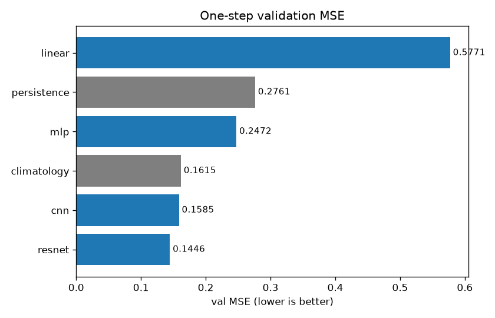
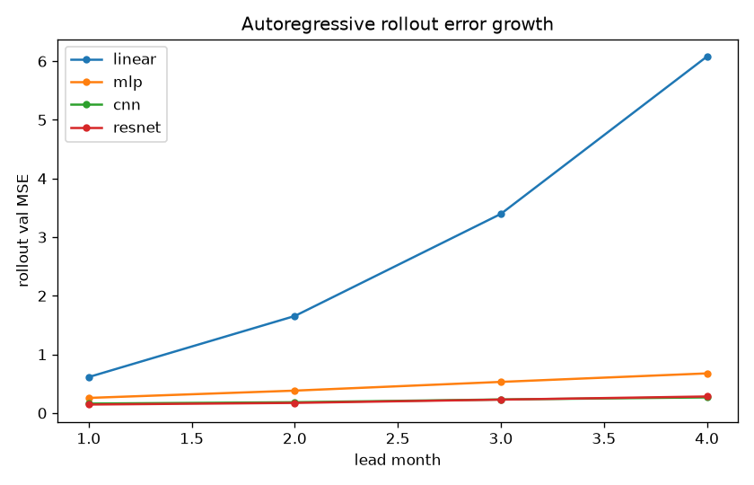
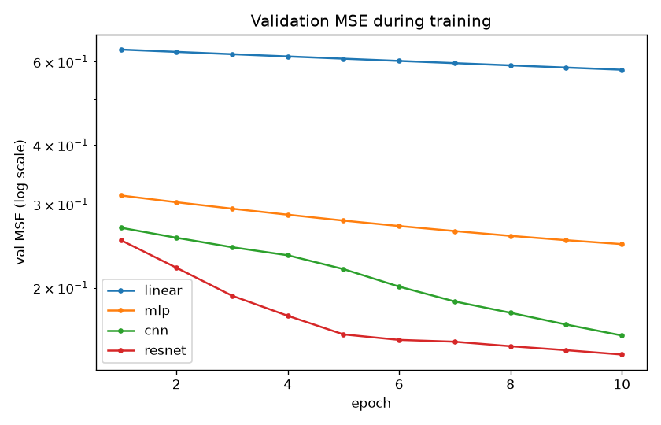
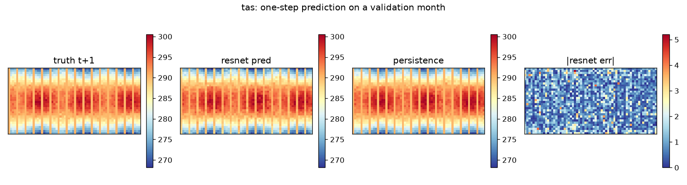
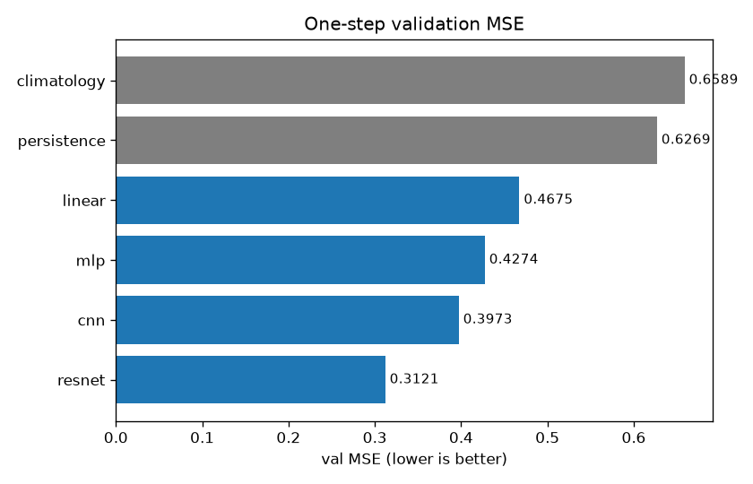
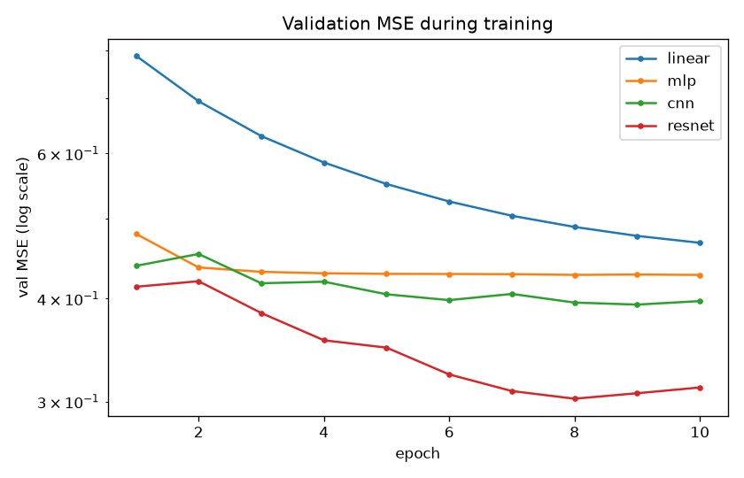
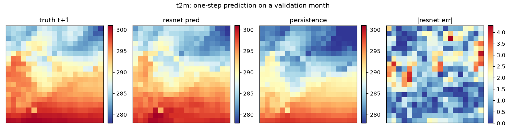

# ML emulator tutorial

Train a neural net to predict next month's state from PlaSiC monthly output:

```
X(t) = [tas, ps, pr, ...](t)   →   X̂(t+Δt)
```

Next-step training in the style of NeuralGCM / GraphCast, scaled down to
run on a laptop CPU.

## Models

`train_emulator.py` trains four architectures and compares them against
two baselines. All four models predict the residual increment, not the
full state:

| Name (`--models`) | Architecture | Params (3 vars, `--hidden 32`) |
|---|---|---|
| `linear` | per-gridpoint linear map across channels (1×1 conv) | 12 |
| `mlp` | per-gridpoint MLP, no spatial context (1×1 convs) | 227 |
| `cnn` | shallow residual CNN, 3×3 convs | 11,011 |
| `resnet` | residual CNN with 3 residual blocks | 57,251 |

Baselines: `persistence` (X̂(t+1) = X(t)) and `climatology` (time mean over
the validation set). `--models cnn,resnet` trains a subset;
`--models all` (default) trains everything.

## Layout

| File | Purpose |
|---|---|
| `plasic_dataset.py` | PyTorch `Dataset` reading PlaSiC monthly NetCDF output (`<var>.nc` files), building `(X_t, X_{t+1})` pairs with per-variable normalization |
| `train_emulator.py` | Training + evaluation: baselines, the four models, chronological train/val split, masked MSE, per-variable metrics, multi-step rollout; writes `emulator_<model>.pt` and `metrics.json` |
| `make_synthetic_sample.py` | Generates tiny synthetic `<var>.nc` files mimicking PlaSiC output so the example runs without a full model run |
| `plot_results.py` | Reads `metrics.json` (+ checkpoints) from a finished run and writes `figures/`: learning curves, model comparison, rollout error growth, and a truth-vs-prediction map |
| `figures/` | Example figures from the two reference runs below |
| `requirements.txt` | Python dependencies |

## Quickstart (no model run needed)

```bash
pip install -r requirements.txt

# 1. create synthetic PlaSiC-like output (tas/ps/pr, 24 months, T21-ish grid)
python make_synthetic_sample.py --out data/synthetic --seed 0

# 2. train the four emulators (CPU is fine)
python train_emulator.py --data data/synthetic --epochs 10 --seed 0
```

The synthetic data contains a predictable signal that propagates across
grid cells. Models with spatial context (cnn, resnet) beat the baselines;
per-gridpoint models (linear, mlp) can't represent propagation, and linear
ends up worse than persistence (0.5771 vs 0.2761).

Useful flags: `--device cuda` (auto-detects by default),
`--models cnn,resnet`, `--hidden 64`, `--epochs 50`, `--lr 3e-4`.

## Reading the output

A typical run ends with:

```
=== val MSE comparison (lower is better) ===
  resnet       params=   57251  val MSE=0.144555
  cnn          params=   11011  val MSE=0.158542
  climatology  params=       -  val MSE=0.161525
  mlp          params=     227  val MSE=0.247213
  persistence  params=       -  val MSE=0.276141
  linear       params=      12  val MSE=0.577097
metrics -> data/synthetic/metrics.json
```

Notes on the numbers:



- `pr` is usually the worst variable by far. Precipitation is intermittent
  and skewed; on normalized MSE it dominates the loss.
- Rollout error should grow with lead time, roughly monotonically. If `+4m`
  beats `+1m`, something is leaking (e.g. teacher forcing in the rollout).
  linear's rollout blows up (+1m 0.61 → +4m 6.08) because one-step errors
  compound when the model can't represent the dynamics.



- `metrics.json` has the per-epoch history and final numbers for every
  model, so you can plot learning curves without re-running.



One validation month, first variable (`tas`): truth vs the best model vs
persistence, plus the model's absolute error map.



All four figures come from `plot_results.py`:

```bash
python plot_results.py --data data/synthetic --out figures
```

## Using real PlaSiC output

1. Run any PlaSiC experiment with monthly NetCDF output enabled (e.g. the
   historical experiment, tutorial §6.2). Each variable is written to
   `<name>.nc` (`tas.nc`, `ps.nc`, `pr.nc`, …) with CF conventions —
   see `src/runtime/monthly_netcdf.c` for the full variable table.
2. Point the scripts at the output directory:
   ```bash
   python train_emulator.py --data /path/to/plasic/output --vars tas ps pr \
       --epochs 50 --hidden 64
   ```
3. For 3-D variables (`ta`, `ua`, `va`, `hus`), `--levels 3` averages the
   lowest 3 levels; edit `plasic_dataset.py` for something else (a single
   level, or all levels as extra channels).

## Training record & reproducibility

### Reference run 1 — synthetic data

Ran end to end on CPU, 2026-10-06. Environment: Python 3.12.3,
torch 2.14.1+cpu, netCDF4 1.7.4, numpy 1.26.4 (2-vCPU VM, no GPU; the full
run took about 15 seconds).

```bash
python make_synthetic_sample.py --out data/synthetic --seed 0
python train_emulator.py --data data/synthetic --epochs 10 --seed 0
```

| Metric | Value |
|---|---|
| train pairs / val pairs | 18 / 5 (chronological split, `--val-frac 0.25`) |
| baseline[persistence] val MSE | 0.276141 |
| baseline[climatology] val MSE | 0.161525 |
| linear val MSE (12 params) | 0.577097 |
| mlp val MSE (227 params) | 0.247213 |
| cnn val MSE (11,011 params) | 0.158542 |
| resnet val MSE (57,251 params) | 0.144555 |
| per-variable val MSE, resnet (tas / ps / pr) | 0.028373 / 0.004460 / 0.400833 |
| rollout val MSE, resnet (+1m … +4m) | 0.144907 / 0.172935 / 0.228903 / 0.282515 |

Reproducibility notes:

- `--seed 0` fixes the synthetic-data generator (`numpy.random`
  default_rng) and training (`torch.manual_seed` + `np.random.seed`), so
  this run is byte-for-byte reproducible on CPU.
- The split is chronological (`--val-frac 0.25` takes the most recent
  months); no future information leaks into training.
- `metrics.json` (written next to the checkpoints in `--data`) has the
  full per-epoch history plus these final numbers.
- On GPU (`--device cuda`) the same seeds can give slightly different
  numbers through cuDNN; the ranking holds.

### Reference run 2 — ERA5 monthly means

Same scripts and flags, trained on real reanalysis instead of synthetic
data:

- Data: ERA5 2m temperature (`t2m`) and total precipitation (`tp`),
  daily fields aggregated to monthly means; East Asia 1.5° grid
  (21–48°N, 114–141°E); January 1940 – December 2024 (1020 months).
- Setup: `--vars t2m tp --epochs 10 --seed 0`, chronological split
  (train 765 months / val 254 months, val = most recent ~21 years).
  CPU-only, a few minutes.
- To reproduce: aggregate any daily ERA5 fields to monthly means and write
  one `<var>.nc` per variable with dims `(time, lat, lon)`;
  `plasic_dataset.load_variable` reads exactly that layout.

| Model | Params | Val MSE | Per-variable (t2m / tp) | Rollout +1m … +4m |
|---|---|---|---|---|
| resnet | 56,674 | 0.312085 | 0.063366 / 0.560804 | 0.312031 / 0.381254 / 0.482828 / 0.605079 |
| cnn | 10,434 | 0.397266 | 0.124129 / 0.670402 | 0.396253 / 0.600448 / 0.857427 / 1.115578 |
| mlp | 162 | 0.427405 | 0.157718 / 0.697093 | 0.425819 / 0.661742 / 0.920777 / 1.134074 |
| linear | 6 | 0.467530 | 0.160495 / 0.774564 | 0.466383 / 0.678374 / 0.916636 / 1.108522 |
| persistence | — | 0.626924 | — | — |
| climatology | — | 0.658933 | — | — |

Differences from the synthetic run: every learned model beats both
baselines here, including linear. Real monthly fields are smoother and
more persistent, so even a per-gridpoint map helps. The architecture
ranking is the same (resnet > cnn > mlp > linear), `tp` carries most of
the error, and rollout error grows monotonically for all four models.





Same spatial check on real data (`t2m`, East Asia): truth vs resnet vs
persistence for one validation month.



## Try it yourself

- Train on anomalies instead of full fields (subtract the climatology in
  `plasic_dataset.py`) and see what changes in the ranking and the
  rollout.
- Push `--epochs` until validation MSE stops improving, then check whether
  the `+4m` rollout stopped improving at the same point.
- Add `pr` after `tas`/`ps` and see how much precipitation changes the
  other variables' errors.
- Add your own architecture to `MODELS` in `train_emulator.py` and see
  where it lands.

## FAQ

**NaN loss in the first epoch?**
Usually a normalization problem: a variable with zero variance (e.g. a
constant field) gives `std = 0`. `compute_stats` guards with `+ 1e-8`, but
check your input files if it still happens.

**`FileNotFoundError: PlaSiC output not found`?**
The script expects one `.nc` file per variable, named exactly `<var>.nc`
inside `--data`. PlaSiC writes these names by default; if you renamed
them, rename back or adjust `load_variable`.

**Can I use this on the restart files instead of monthly means?**
Not directly. Restarts are spectral coefficients, a different layout.
Monthly means are the intended input; tutorial §6.4 describes what's in
the restart files.

**Why is rollout error so much larger than one-step error?**
Rollout feeds the model's own imperfect predictions back in, so errors
compound. One-step error is optimistic; rollout is the stricter number.

## Notes / limitations

- Monthly means are coarse for weather emulation. For real work you'd want
  higher-frequency output or the restart files (tutorial §6.4).
- `_FillValue` (land/ocean-masked points) is masked out of the loss.
- Not tried yet: train/val/test splits by year, early stopping.
